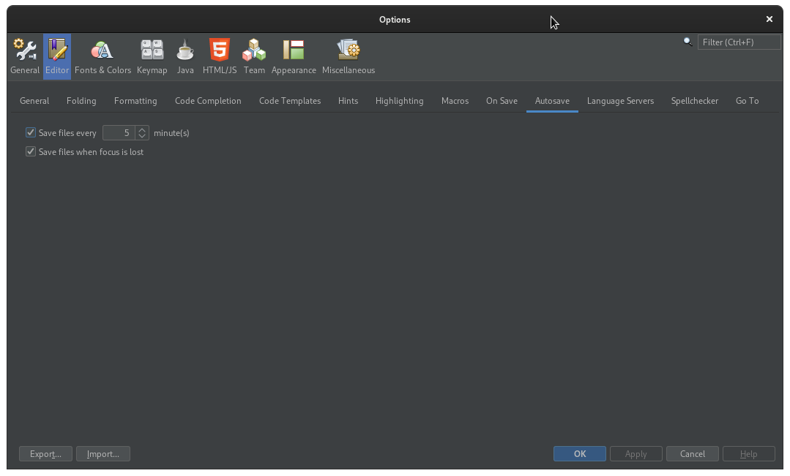

# NetBeans plugin to save automatically opened files

The main goal of this simple plugin is to make possible to save file automatically in the IDE. There are two option:
* Save after a predefined amount of time;
* Save after focus is lost;

## Download

[NetBeans 10 and superior](https://github.com/mgraciano/netbeans-module-autosave/releases/latest)

## Options

These configurations can be done using the IDE Options dialog at Tools > Options:



## Preparing a release

```
mvn clean
mvn -Prelease-nbm,ossrh release:prepare
mvn -Prelease-nbm,ossrh release:perform
```

#netbeans #autosave #plugin #module
